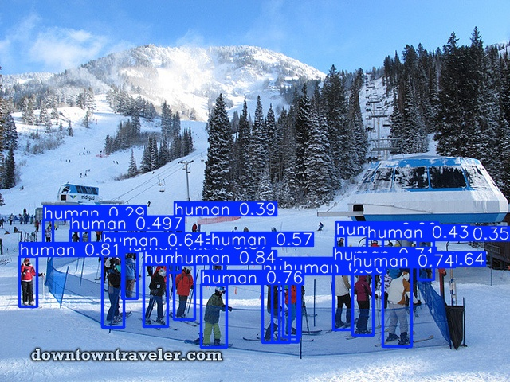
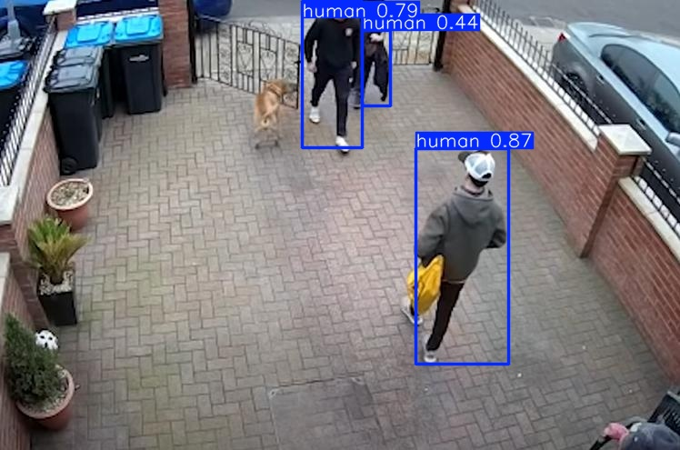
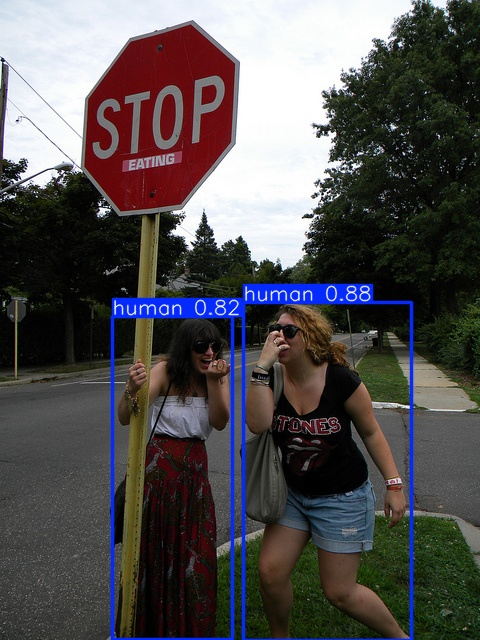

#  Human Detection using YOLOv8

A deep learning project for detecting and counting humans in images, videos, and webcam streams using **YOLOv8**.

---

##  Features

* Detects humans in real-time or from images/videos.
* Trained on a custom dataset with **4000 labeled images**.
* Works with multiple image formats (`.jpg`, `.png`, `.webp`).
* Simple commands for training and testing.

---

##  Tech Stack

* **Python 3.11**
* **YOLOv8 (Ultralytics)**
* **PyTorch**
* **OpenCV** (for webcam support)

---

##  Folder Structure

```
human-detection-yolov8/
│
├── dataset/
│   ├── images/          # train / val images
│   └── labels/          # train / val labels
│
├── scripts/
│   └── split_dataset.py
│
├── runs/                # Training results and weights
├── data.yaml            # Dataset configuration
├── requirements.txt      # Dependencies
└── README.md
```

---

##  Installation

```bash
git clone https://github.com/SedatAtakanYildiz/human-detection-yolov8.git
cd human-detection-yolov8
pip install -r requirements.txt
pip install ultralytics
```

---

##  Training

```bash
yolo detect train data=data.yaml model=yolov8n.pt epochs=50 imgsz=640
```

---

##  Testing

* **Image:**

  ```bash
  yolo detect predict model=runs/detect/train/weights/best.pt source="image.jpg"
  ```
* **Webcam:**

  ```bash
  yolo detect predict model=runs/detect/train/weights/best.pt source=0
  ```

---

##  Results

Example detections:





---

##  Model Weights

Download trained model: [**best.pt**](https://drive.google.com/uc?id=1KFO_SOG3rZrbq4Zc-Lws2zfeeSQr9bTd)

---

##  Author

**Sedat Atakan Yıldız**
 Email: [s.atakanyildiz@gmail.com](mailto:s.atakanyildiz@gmail.com)
